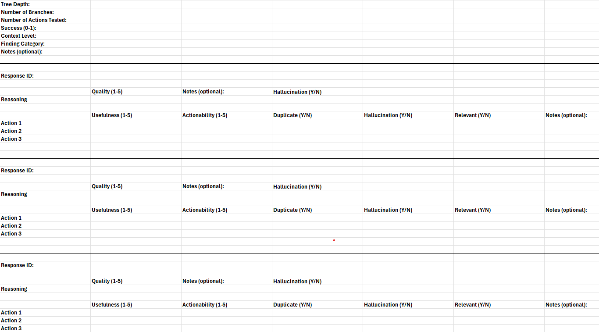

# llm-bsc-analysis
Code used for analyzing Excel-based evaluation data of large language models (LLMs) across different scenarios. Developed for our Bachelor thesis, this repository includes scripts to parse evaluation sheets, compute performance metrics, and compare LLM outputs, ensuring a transparent and reproducible analysis workflow.


## Usage

**Clone the repository**
```sh
git clone https://github.com/your-username/llm-bsc-analysis.git
cd llm-bsc-analysis
```

**install requirements**
```sh
pip install -r requirements.txt
```

**Run Analysis Script**
```sh
python main.py -f input_file.xlsx
```

## Database Schema
https://github.com/andreasrtv/llm-logger/blob/9e7991bd61937e2fb26c6f181752ae8a9a90ee68/src/app/models.py

## Evaluation Template


